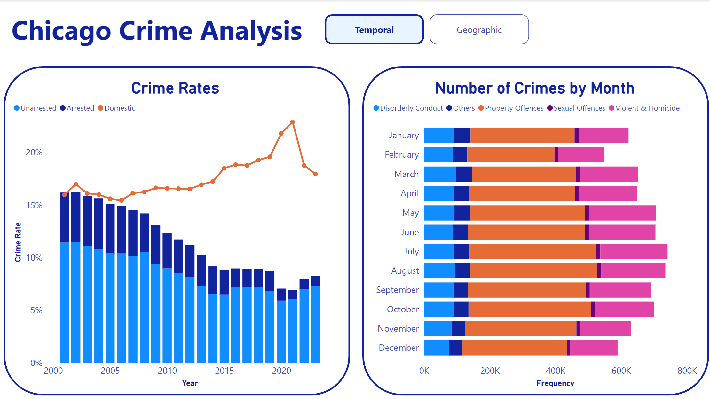
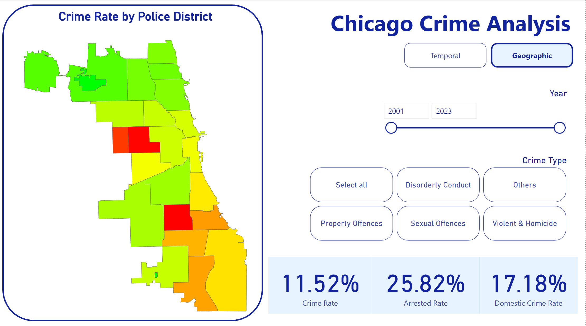
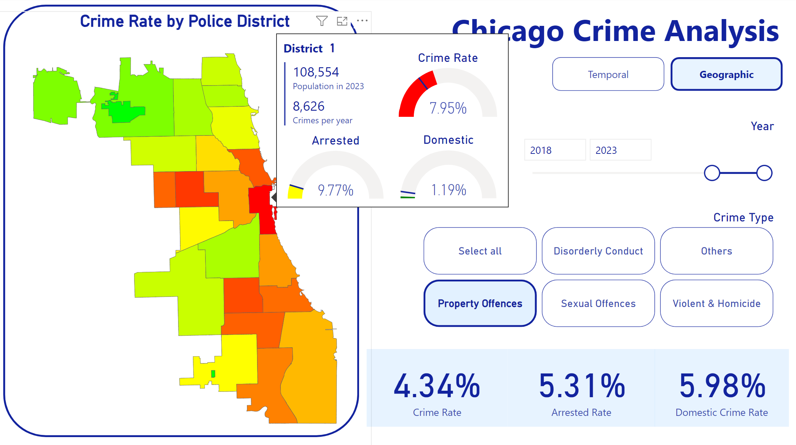

# Chicago Crime Data Analysis

## Introduction
This project analyzes Chicago Crime Data (2001-2023), exploring temporal and geographic trends. Key findings include decreasing overall crime and arrest rates, a spike in domestic crimes during the pandemic, and the prevalence of property offenses. Seasonal and geographical variations, along with district-specific insights, are highlighted. Acknowledging data contributors, the project aims to provide valuable insights into Chicago's crime dynamics.

## Acknowledgements
The Chicago Crime Data from 2001 to 2023 have been generously provided by the Chicago Police Department and the City of Chicago. This dataset is publicly available on Chicago Data Portal https://data.cityofchicago.org/Public-Safety/Crimes-2001-to-Present/ijzp-q8t2/about_data with applicable terms.

Additionally, the population data by police district in Chicago have been contributed by the Chicago Recovery Plan, accessible at Chicago Recovery Plan - Geographies https://chirecoveryplan.com/geographies/#police-districts.

## Snapshots

